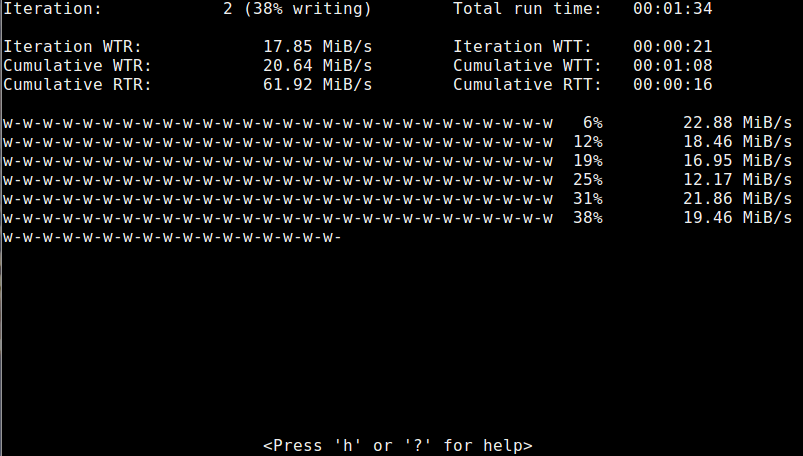

# Spew -- a load generating tool

The spew program is used to test I/O performance and to generate load
on character devices, block devices, and file systems.  It is similar
to the lmdd program found in the lmbench test-suite
(http://www.bitmover.com/lmbench). It is a bit easier to use than lmdd
and has some added functionality.  For example, it can test both
random and sequential I/O.

The spew project is maintained in GitHub.  It can be found at:

   https://github.com/apatters/spew

Spew creates an output and/or input stream and writes and/or reads to
and/or from a file or device. It can be used on both random-access
(disk drives) and sequential-access (tape drives) devices. Various
patterns can be used to test data integrity.

## Spew basic operation

The spew program has three modes, --write, --read, and
--read-after-write (or --raw). The --write mode just writes data to
the file or device. The --read mode reads data from a file. The
--read-after-write mode will write the data then read it back in while
doing data verification.

The spew program can generate both cumulative and semi-instantaneous
transfer-rate statistics. Here is an example of spew being used to
test the sequential transfer rate to a file system:

```
$ spew --pattern=random --min-buffer-size=64k 1g /tmp/bigfile
Write transfer rate:    46677.47 KiB/s    Transfer time: 00:00:22
```

## Spew progress option

You can use the --progress option to display a "progress-meter" that
also shows intermediate transfer rates:

```
$ spew --read-after-write --progress --pattern=numbers \
--min-buffer-size=64k 1g /tmp/bigfile
w-w-w-w-w-w-w-w-w-w-w-w-w-w-w-w-w-w-w-w-w-w-w-w-w-w   6%   198344.51 KiB/s
w-w-w-w-w-w-w-w-w-w-w-w-w-w-w-w-w-w-w-w-w-w-w-w-w-w  12%   180722.66 KiB/s
w-w-w-w-w-w-w-w-w-w-w-w-w-w-w-w-w-w-w-w-w-w-w-w-w-w  19%   180448.48 KiB/s
w-w-w-w-w-w-w-w-w-w-w-w-w-w-w-w-w-w-w-w-w-w-w-w-w-w  25%   180828.37 KiB/s
w-w-w-w-w-w-w-w-w-w-w-w-w-w-w-w-w-w-w-w-w-w-w-w-w-w  31%   175934.15 KiB/s
w-w-w-w-w-w-w-w-w-w-w-w-w-w-w-w-w-w-w-w-w-w-w-w-w-w  38%   176317.55 KiB/s
w-w-w-w-w-w-w-w-w-w-w-w-w-w-w-w-w-w-w-w-w-w-w-w-w-w  44%   176369.75 KiB/s
w-w-w-w-w-w-w-w-w-w-w-w-w-w-w-w-w-w-w-w-w-w-w-w-w-w  50%   175558.53 KiB/s
w-w-w-w-w-w-w-w-w-w-w-w-w-w-w-w-w-w-w-w-w-w-w-w-w-w  56%   175559.94 KiB/s
w-w-w-w-w-w-w-w-w-w-w-w-w-w-w-w-w-w-w-w-w-w-w-w-w-w  62%    33211.64 KiB/s
w-w-w-w-w-w-w-w-w-w-w-w-w-w-w-w-w-w-w-w-w-w-w-w-w-w  69%    18744.87 KiB/s
w-w-w-w-w-w-w-w-w-w-w-w-w-w-w-w-w-w-w-w-w-w-w-w-w-w  75%   171271.02 KiB/s
w-w-w-w-w-w-w-w-w-w-w-w-w-w-w-w-w-w-w-w-w-w-w-w-w-w  81%    14932.66 KiB/s
w-w-w-w-w-w-w-w-w-w-w-w-w-w-w-w-w-w-w-w-w-w-w-w-w-w  88%   169616.72 KiB/s
w-w-w-w-w-w-w-w-w-w-w-w-w-w-w-w-w-w-w-w-w-w-w-w-w-w  94%   170134.11 KiB/s
w-w-w-w-w-w-w-w-w-w-w-w-w-w-w-w-w-w-w-w-w-w-w-w-w-w 100%   171290.72 KiB/s
Write transfer rate:    71438.31 KiB/s    Transfer time: 00:00:14

r-r-r-r-r-r-r-r-r-r-r-r-r-r-r-r-r-r-r-r-r-r-r-r-r-r   6%     5650.53 KiB/s
r-r-r-r-r-r-r-r-r-r-r-r-r-r-r-r-r-r-r-r-r-r-r-r-r-r  12%    42761.38 KiB/s
r-r-r-r-r-r-r-r-r-r-r-r-r-r-r-r-r-r-r-r-r-r-r-r-r-r  19%    51937.35 KiB/s
r-r-r-r-r-r-r-r-r-r-r-r-r-r-r-r-r-r-r-r-r-r-r-r-r-r  25%    46905.78 KiB/s
r-r-r-r-r-r-r-r-r-r-r-r-r-r-r-r-r-r-r-r-r-r-r-r-r-r  31%    50760.52 KiB/s
r-r-r-r-r-r-r-r-r-r-r-r-r-r-r-r-r-r-r-r-r-r-r-r-r-r  38%    46721.39 KiB/s
r-r-r-r-r-r-r-r-r-r-r-r-r-r-r-r-r-r-r-r-r-r-r-r-r-r  44%    52162.35 KiB/s
r-r-r-r-r-r-r-r-r-r-r-r-r-r-r-r-r-r-r-r-r-r-r-r-r-r  50%    38172.26 KiB/s
r-r-r-r-r-r-r-r-r-r-r-r-r-r-r-r-r-r-r-r-r-r-r-r-r-r  56%    41188.34 KiB/s
r-r-r-r-r-r-r-r-r-r-r-r-r-r-r-r-r-r-r-r-r-r-r-r-r-r  62%    47083.10 KiB/s
r-r-r-r-r-r-r-r-r-r-r-r-r-r-r-r-r-r-r-r-r-r-r-r-r-r  69%    51387.36 KiB/s
r-r-r-r-r-r-r-r-r-r-r-r-r-r-r-r-r-r-r-r-r-r-r-r-r-r  75%    48277.87 KiB/s
r-r-r-r-r-r-r-r-r-r-r-r-r-r-r-r-r-r-r-r-r-r-r-r-r-r  81%    48538.21 KiB/s
r-r-r-r-r-r-r-r-r-r-r-r-r-r-r-r-r-r-r-r-r-r-r-r-r-r  88%   123075.07 KiB/s
r-r-r-r-r-r-r-r-r-r-r-r-r-r-r-r-r-r-r-r-r-r-r-r-r-r  94%   179621.55 KiB/s
r-r-r-r-r-r-r-r-r-r-r-r-r-r-r-r-r-r-r-r-r-r-r-r-r-r 100%   176579.31 KiB/s
Read transfer rate:     35313.10 KiB/s    Transfer time: 00:00:29
```

## Terminal User Interface (TUI)

Spew has a terminal user interface that lets you observe its operation
without the need for scrolling. It is especially useful when running
spew with the -i|--iterations option. Here is a screen shot of the
spew TUI in operation:



## The -g|--generate--load option

Spew has the -g|--generate load option that combines many commonly used
options together. The command-line syntax then becomes much simpler, eg.,

```
$ spew --raw -g -b 64k 1g /dev/sdb
```

Consult the man-page for details.

## Examples

```
$ spew --write -b 16k 1m /tmp/bigfile
```

Writes 1 mebibyte (1 mebibyte = 1024*1024 bytes) using 16 kibibytes (1
kibibyte = 1024 bytes) requests to the file /tmp/bigfile using the
default pattern (random).  Displays the write transfer rate in
kibibytes per second and the write transfer time in seconds.

```
$ spew --write -u m -i 10 -b 1k 256k /dev/sda1
```

Writes 256 kibibytes using 1 kibibyte requests to the block device
file /dev/sda1 10 times using the default pattern (random).  The
iteration and cumulative write transfer rates are displayed in
mebibytes per sec‐ ond and the iteration and cumulative write transfer
times are displayed in seconds.

```
$ spew --raw -d -o 1m -b 16m 1g /tmp/bigfile
```

Write 1 gibibyte (1 gibibyte = 1024*1024*1024 bytes) starting at an
offset of 1 mebibyte using 16 mebibyte requests to the file
/tmp/bigfile using the default pattern (random).  The data is written
synchronously and flushed at file close.  Then read in the same data
using the same request size and offset.  The data is checked to ensure
that the data read in matches the data read out.  Write and read
transfer rates are displayed in kibibytes/second.  Read and write
transfer times are displayed in seconds.

```
$ spew --read -i 0 -u M -p zeros -b 512 1m /dev/zero
```

Read 1 mebibyte of data using 512 byte requests from the file
/dev/zero an infinite number of times using the zeros pattern (don't
check the data).  The iteration and cumulative read transfer rates are
displayed in megabytes (1 megabyte = 1,000,000 bytes) per second and
the iteration and cumulative read transfer times are displayed in
seconds.

```
$ spew --raw -g -r -b 1k -B 256K 1t /dev/md1
```

Write 1 tebibyte (1 tebibyte = 1024*1024*1024*1024 bytes) using 1-256
kibibyte requests to the block device /dev/md1 using the random pat‐
tern.  Random seeks are performed before each transfer, but each block
between the start and end of the data is written exactly once.  The
request sizes are chosen randomly.  Then read in the same data using
the same request sizes and seeks in the same sequence.  Repeat the
above sequence an infinite number of times until told to quit (via
signal or TUI command).

The data is checked to ensure that the data read in matches the data
read out.  A curses-based TUI is used to display iteration and
cumulative transfer rates, transfer times, and bytes transferred.
Display verbose statistics after quitting.

## Configuration files

You can place command-line defaults in one of three locations,
`/etc/spew.conf`, `$HOME/.spewrc`, or where the environment variable
`$SPEWRC` points.

## Other command-line options

Spew has a lot of different options.  Consult the man-page for more
information.

